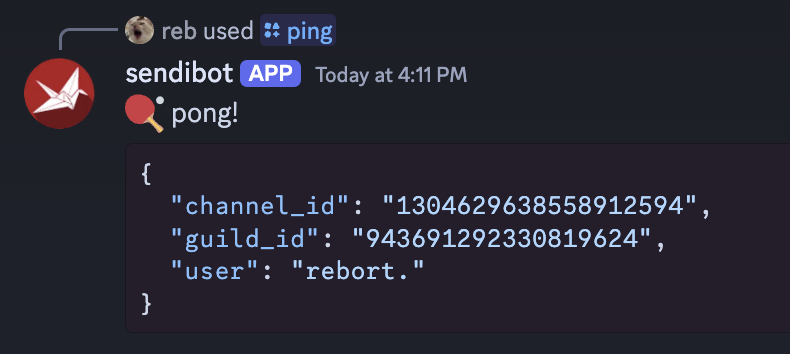
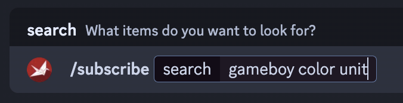
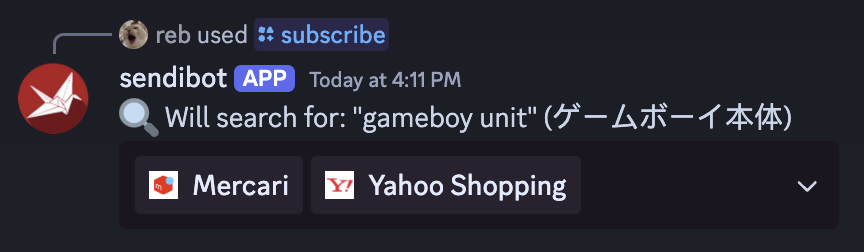
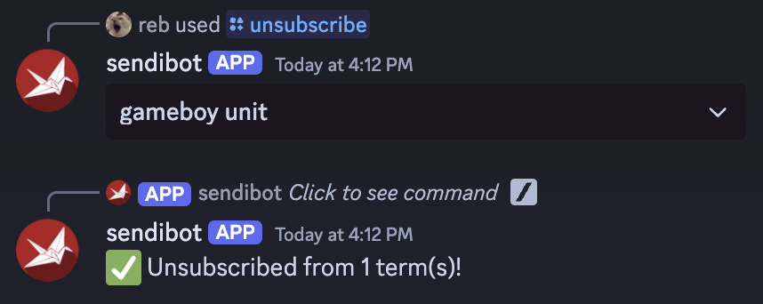
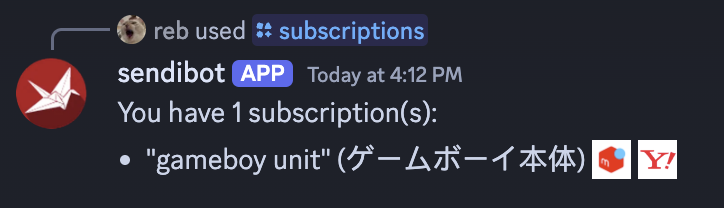

# sendibot

Subscribe to Sendico updates via Discord.

## Development

1. Set `DISCORD_TOKEN` env var.
2. Need a writeable volume to track subscriptions and updates in SQLite. By default `./sendico.db` is created.
3. Build: `go build`
4. Run: `./sendibot` (or `./sendibot -help` for options)
5. (optional) Add emojis to your bot for [the store identifiers](https://github.com/robherley/sendibot/blob/6f0a90cb7ee5409ed6730c81e3c6924e4d1c8e5b/pkg/sendico/shop.go#L34-L47) to have them displayed in commands.

## Commands

### `/ping`

Pings the bot!

### `/subscribe`

Subscribe to a search term and shops.

### `/unsubscribe`

Unsubscribe from search terms(s).

### `/subscriptions`

View active subscriptions.

